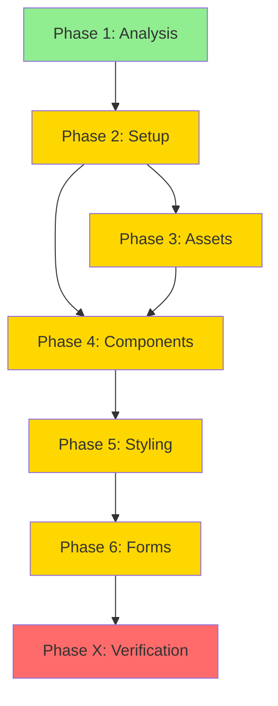

# TruBalance Website - Project Plan

## Overview

**Project:** TruBalance Tax Preparation Website  
**Type:** WEB (Static Marketing Site)  
**Goal:** Create a fully responsive, modern marketing website for TruBalance tax preparation services with contact form functionality.

**Design Reference:** Professional tax preparation service website with clean, modern aesthetic featuring:
- Hero section with professional imagery
- About section highlighting company values
- Services showcase (7 core services)
- Statistics/credibility section
- Why Choose section with key differentiators
- Contact form with professional styling

---

## Success Criteria

| Metric | Target | Verification |
|--------|--------|--------------|
| **Responsive Design** | Works flawlessly on mobile (320px+), tablet (768px+), desktop (1024px+) | Manual testing on multiple devices |
| **Performance** | Lighthouse score ≥90 (Performance, Accessibility, Best Practices, SEO) | `lighthouse_audit.py` |
| **Accessibility** | WCAG AA compliant, touch targets ≥44px | `ux_audit.py`, manual testing |
| **Form Functionality** | Contact form submits successfully to Netlify Forms | Manual testing |
| **Build Success** | Production build completes without errors | `npm run build` |
| **Security** | No critical vulnerabilities in dependencies | `security_scan.py` |

---

## Tech Stack

| Layer | Technology | Rationale |
|-------|-----------|-----------|
| **Framework** | React 18 + Vite | Fast dev experience, optimal for static sites, excellent build performance |
| **Styling** | Tailwind CSS v4 | Modern utility-first CSS, excellent for responsive design, smaller bundle size |
| **Form Handling** | Netlify Forms | Native integration, no backend needed, spam protection included |
| **Deployment** | Netlify | Free tier, automatic deployments, form handling built-in, excellent DX |
| **Image Generation** | AI-generated assets | Professional imagery matching design aesthetic |

**Dependencies:**
```json
{
  "react": "^18.3.1",
  "react-dom": "^18.3.1",
  "vite": "^6.0.0",
  "@vitejs/plugin-react": "^4.3.4",
  "tailwindcss": "^4.0.0"
}
```

---

## Project Type

**WEB** - Static marketing website (frontend-only)

**Primary Agent:** `frontend-specialist`  
**Skills:** `frontend-design`, `clean-code`, `seo-fundamentals`

---

## File Structure

```
trubalance-website/
├── public/
│   ├── images/
│   │   ├── hero-office.png          # Generated: Modern office with desk
│   │   ├── about-professional.png   # Generated: Professional working
│   │   ├── stats-collaboration.png  # Generated: Team collaboration
│   │   └── contact-calculator.png   # Generated: Calculator illustration
│   └── favicon.ico
├── src/
│   ├── components/
│   │   ├── layout/
│   │   │   ├── Header.jsx
│   │   │   └── Footer.jsx
│   │   ├── sections/
│   │   │   ├── Hero.jsx
│   │   │   ├── About.jsx
│   │   │   ├── Services.jsx
│   │   │   ├── Stats.jsx
│   │   │   ├── WhyChoose.jsx
│   │   │   └── Contact.jsx
│   │   └── ui/
│   │       ├── Button.jsx
│   │       ├── ServiceCard.jsx
│   │       └── FeatureCard.jsx
│   ├── App.jsx
│   ├── main.jsx
│   └── index.css                    # Tailwind directives + custom styles
├── index.html
├── vite.config.js
├── tailwind.config.js
├── postcss.config.js
├── package.json
├── netlify.toml                     # Netlify configuration
└── README.md
```

---

## Task Breakdown

### **PHASE 1: ANALYSIS** ✅

#### Task 1.1: Design Analysis
- **Agent:** `project-planner`
- **Skills:** `brainstorming`, `plan-writing`
- **Priority:** P0 (Foundation)
- **Dependencies:** None
- **INPUT:** Uploaded design image
- **OUTPUT:** Identified sections, components, color scheme, typography
- **VERIFY:** All sections documented in plan

**Status:** ✅ COMPLETE

---

### **PHASE 2: PROJECT SETUP**

#### Task 2.1: Initialize Vite Project
- **Agent:** `frontend-specialist`
- **Skills:** `clean-code`, `nodejs-best-practices`
- **Priority:** P0 (Foundation)
- **Dependencies:** None
- **INPUT:** Empty project directory
- **OUTPUT:** Working Vite + React project with dev server running
- **VERIFY:** `npm run dev` starts without errors

**Commands:**
```bash
npm create vite@latest . -- --template react
npm install
```

#### Task 2.2: Configure Tailwind CSS v4
- **Agent:** `frontend-specialist`
- **Skills:** `tailwind-patterns`, `frontend-design`
- **Priority:** P0 (Foundation)
- **Dependencies:** Task 2.1
- **INPUT:** Vite project
- **OUTPUT:** Tailwind configured with custom design tokens
- **VERIFY:** Tailwind utilities work in components

**Commands:**
```bash
npm install -D tailwindcss@next postcss autoprefixer
npx tailwindcss init -p
```

**Design Tokens (from design):**
- Primary: Beige/Tan (#E8DCC4, #D4C5A9)
- Accent: Black (#1A1A1A)
- Text: Dark gray (#2D2D2D)
- Background: Off-white (#FAF8F5)

#### Task 2.3: Project Structure Setup
- **Agent:** `frontend-specialist`
- **Skills:** `clean-code`
- **Priority:** P0 (Foundation)
- **Dependencies:** Task 2.1
- **INPUT:** Base Vite structure
- **OUTPUT:** Organized folder structure with placeholder components
- **VERIFY:** All directories exist, imports resolve

#### Task 2.4: Netlify Configuration
- **Agent:** `frontend-specialist`
- **Skills:** `deployment-procedures`
- **Priority:** P1 (Core)
- **Dependencies:** Task 2.1
- **INPUT:** Vite project
- **OUTPUT:** `netlify.toml` with build settings
- **VERIFY:** File exists with correct build command

**netlify.toml:**
```toml
[build]
  command = "npm run build"
  publish = "dist"

[[redirects]]
  from = "/*"
  to = "/index.html"
  status = 200
```

---

### **PHASE 3: ASSET GENERATION**

#### Task 3.1: Generate Hero Image
- **Agent:** `frontend-specialist`
- **Skills:** `frontend-design`
- **Priority:** P1 (Core)
- **Dependencies:** Task 2.3
- **INPUT:** Design reference (modern office with desk and laptop)
- **OUTPUT:** `public/images/hero-office.png` (1920x1080px)
- **VERIFY:** Image exists, appropriate size, matches aesthetic

**Prompt:** "Modern minimalist office interior with a sleek desk, laptop, and large windows showing city view, professional lighting, clean aesthetic, beige and white color palette, photorealistic"

#### Task 3.2: Generate About Image
- **Agent:** `frontend-specialist`
- **Skills:** `frontend-design`
- **Priority:** P1 (Core)
- **Dependencies:** Task 2.3
- **INPUT:** Design reference (professional working on laptop)
- **OUTPUT:** `public/images/about-professional.png` (800x600px)
- **VERIFY:** Image exists, matches design aesthetic

**Prompt:** "Professional woman working on laptop in modern office, focused expression, natural lighting, warm tones, business casual attire, clean background, photorealistic"

#### Task 3.3: Generate Stats Image
- **Agent:** `frontend-specialist`
- **Skills:** `frontend-design`
- **Priority:** P1 (Core)
- **Dependencies:** Task 2.3
- **INPUT:** Design reference (team collaboration)
- **OUTPUT:** `public/images/stats-collaboration.png` (1200x800px)
- **VERIFY:** Image exists, conveys teamwork

**Prompt:** "Business professionals collaborating with laptops and documents, modern office setting, diverse team, warm professional lighting, beige and blue tones, photorealistic"

#### Task 3.4: Generate Contact Illustration
- **Agent:** `frontend-specialist`
- **Skills:** `frontend-design`
- **Priority:** P1 (Core)
- **Dependencies:** Task 2.3
- **INPUT:** Design reference (calculator icon)
- **OUTPUT:** `public/images/contact-calculator.png` (400x400px)
- **VERIFY:** Image exists, clean illustration style

**Prompt:** "Minimalist 3D illustration of a calculator with tax documents, clean design, beige and black color scheme, soft shadows, modern aesthetic"

---

### **PHASE 4: COMPONENT DEVELOPMENT**

#### Task 4.1: Create Layout Components
- **Agent:** `frontend-specialist`
- **Skills:** `react-best-practices`, `clean-code`, `frontend-design`
- **Priority:** P0 (Foundation)
- **Dependencies:** Task 2.2, Task 2.3
- **INPUT:** Tailwind configuration, design reference
- **OUTPUT:** `Header.jsx` and `Footer.jsx` with navigation and branding
- **VERIFY:** Components render, navigation links work, responsive on mobile

**Header Requirements:**
- Logo: "TruBalance" with "Trusted Accounting" tagline
- Navigation: About, Services, Contact
- Mobile hamburger menu
- Sticky on scroll

**Footer Requirements:**
- Company info
- Quick links
- Contact details
- Copyright notice

#### Task 4.2: Build Hero Section
- **Agent:** `frontend-specialist`
- **Skills:** `frontend-design`, `react-best-practices`
- **Priority:** P1 (Core)
- **Dependencies:** Task 3.1, Task 4.1
- **INPUT:** Hero image, design reference
- **OUTPUT:** `Hero.jsx` with headline, subheadline, CTA button
- **VERIFY:** Section renders, image loads, CTA scrolls to contact

**Content:**
- Headline: "Providing Seamless Tax Preparation"
- Subheadline: "Expert tax services tailored to your needs with precision and care"
- CTA: "Get Started" (scrolls to contact form)

#### Task 4.3: Build About Section
- **Agent:** `frontend-specialist`
- **Skills:** `frontend-design`, `react-best-practices`
- **Priority:** P1 (Core)
- **Dependencies:** Task 3.2, Task 4.1
- **INPUT:** About image, design reference
- **OUTPUT:** `About.jsx` with company description
- **VERIFY:** Section renders, image positioned correctly, text readable

**Content:**
- Title: "About TruBalance"
- Description: Company values and mission statement

#### Task 4.4: Build Services Section
- **Agent:** `frontend-specialist`
- **Skills:** `frontend-design`, `react-best-practices`, `clean-code`
- **Priority:** P1 (Core)
- **Dependencies:** Task 4.1
- **INPUT:** Design reference (7 services with icons)
- **OUTPUT:** `Services.jsx` with service cards, `ServiceCard.jsx` component
- **VERIFY:** All 7 services display, grid layout responsive

**Services:**
1. Corporate Tax Filings
2. Accounting Services
3. Bookkeeping
4. Payroll Management
5. Personal Tax Preparation
6. CRA Audits
7. Personal & Corporate Tax Planning

**Icons:** Use emoji or simple SVG icons for each service

#### Task 4.5: Build Stats Section
- **Agent:** `frontend-specialist`
- **Skills:** `frontend-design`, `react-best-practices`
- **Priority:** P1 (Core)
- **Dependencies:** Task 3.3, Task 4.1
- **INPUT:** Stats image, design reference
- **OUTPUT:** `Stats.jsx` with 3 statistics
- **VERIFY:** Stats display prominently, image background works

**Stats:**
- 500+ Companies We've Served
- 99% Client Satisfaction Rate
- 5+ Years of Expert Service

#### Task 4.6: Build Why Choose Section
- **Agent:** `frontend-specialist`
- **Skills:** `frontend-design`, `react-best-practices`
- **Priority:** P1 (Core)
- **Dependencies:** Task 4.1
- **INPUT:** Design reference (6 features)
- **OUTPUT:** `WhyChoose.jsx` with feature cards, `FeatureCard.jsx` component
- **VERIFY:** All features display, grid responsive

**Features:**
1. Maximizing Tax Savings
2. Strategic Tax Planning
3. Personalized Accounting
4. Comprehensive Financial Solutions
5. Proactive Tax Assistance
6. Dedicated Support

#### Task 4.7: Build Contact Form Section
- **Agent:** `frontend-specialist`
- **Skills:** `frontend-design`, `react-best-practices`, `clean-code`
- **Priority:** P1 (Core)
- **Dependencies:** Task 3.4, Task 4.1
- **INPUT:** Contact illustration, Netlify Forms documentation
- **OUTPUT:** `Contact.jsx` with form validation
- **VERIFY:** Form fields validate, Netlify attributes present

**Form Fields:**
- Name (required)
- Email (required, validated)
- Phone (optional)
- Message (required, textarea)
- Submit button

**Netlify Form Setup:**
```jsx
<form name="contact" method="POST" data-netlify="true">
  <input type="hidden" name="form-name" value="contact" />
  {/* form fields */}
</form>
```

---

### **PHASE 5: STYLING & RESPONSIVENESS**

#### Task 5.1: Implement Mobile-First Responsive Design
- **Agent:** `frontend-specialist`
- **Skills:** `frontend-design`, `tailwind-patterns`
- **Priority:** P1 (Core)
- **Dependencies:** All Phase 4 tasks
- **INPUT:** All components
- **OUTPUT:** Fully responsive layouts for mobile, tablet, desktop
- **VERIFY:** Manual testing on Chrome DevTools (320px, 768px, 1024px, 1920px)

**Breakpoints:**
- Mobile: 320px - 767px (single column)
- Tablet: 768px - 1023px (2 columns for grids)
- Desktop: 1024px+ (3-4 columns for grids)

#### Task 5.2: Add Animations & Transitions
- **Agent:** `frontend-specialist`
- **Skills:** `frontend-design`, `react-best-practices`
- **Priority:** P2 (Polish)
- **Dependencies:** Task 5.1
- **INPUT:** Styled components
- **OUTPUT:** Smooth transitions, scroll animations, hover effects
- **VERIFY:** Animations feel smooth (60fps), no jank

**Animations:**
- Fade-in on scroll (sections)
- Hover effects on buttons/cards
- Smooth scroll to contact form
- Mobile menu slide-in

#### Task 5.3: Ensure WCAG AA Accessibility
- **Agent:** `frontend-specialist`
- **Skills:** `frontend-design`, `web-design-guidelines`
- **Priority:** P1 (Core)
- **Dependencies:** Task 5.1
- **INPUT:** All components
- **OUTPUT:** Accessible components with proper ARIA labels, contrast ratios
- **VERIFY:** `ux_audit.py`, manual keyboard navigation testing

**Requirements:**
- Color contrast ≥4.5:1 for text
- Focus indicators on all interactive elements
- Semantic HTML (headings, landmarks)
- Alt text for all images
- Form labels properly associated

#### Task 5.4: Optimize Touch Targets
- **Agent:** `frontend-specialist`
- **Skills:** `frontend-design`, `mobile-design`
- **Priority:** P1 (Core)
- **Dependencies:** Task 5.1
- **INPUT:** Interactive elements
- **OUTPUT:** Touch targets ≥44x44px on mobile
- **VERIFY:** `ux_audit.py`, manual mobile testing

---

### **PHASE 6: FORM INTEGRATION**

#### Task 6.1: Implement Form Validation
- **Agent:** `frontend-specialist`
- **Skills:** `react-best-practices`, `clean-code`
- **Priority:** P1 (Core)
- **Dependencies:** Task 4.7
- **INPUT:** Contact form component
- **OUTPUT:** Client-side validation with error messages
- **VERIFY:** Invalid inputs show errors, valid inputs clear errors

**Validation Rules:**
- Name: Required, min 2 characters
- Email: Required, valid email format
- Message: Required, min 10 characters

#### Task 6.2: Set Up Netlify Forms
- **Agent:** `frontend-specialist`
- **Skills:** `deployment-procedures`
- **Priority:** P1 (Core)
- **Dependencies:** Task 6.1, Task 2.4
- **INPUT:** Contact form with Netlify attributes
- **OUTPUT:** Form submits to Netlify, appears in dashboard
- **VERIFY:** Submit test form after deployment, check Netlify dashboard

**Setup:**
1. Add `data-netlify="true"` to form
2. Add hidden input with form name
3. Add honeypot field for spam protection
4. Deploy to Netlify
5. Test submission

#### Task 6.3: Add Success/Error States
- **Agent:** `frontend-specialist`
- **Skills:** `react-best-practices`, `frontend-design`
- **Priority:** P1 (Core)
- **Dependencies:** Task 6.2
- **INPUT:** Form submission logic
- **OUTPUT:** Success message on submit, error handling for failures
- **VERIFY:** Success message displays, form resets after success

---

### **PHASE X: VERIFICATION** (MANDATORY)

> 🔴 **DO NOT mark project complete until ALL checks pass.**

#### Verification 1: Security Scan
- **Command:** `python .agent/skills/vulnerability-scanner/scripts/security_scan.py .`
- **Pass Criteria:** No critical vulnerabilities
- **Status:** [ ]

#### Verification 2: UX Audit
- **Command:** `python .agent/skills/frontend-design/scripts/ux_audit.py .`
- **Pass Criteria:** No critical UX violations, touch targets ≥44px
- **Status:** [ ]

#### Verification 3: Accessibility Check
- **Manual:** Keyboard navigation, screen reader testing
- **Pass Criteria:** All interactive elements accessible, proper focus management
- **Status:** [ ]

#### Verification 4: Lighthouse Audit
- **Command:** `python .agent/skills/performance-profiling/scripts/lighthouse_audit.py http://localhost:3000`
- **Pass Criteria:** All scores ≥90 (Performance, Accessibility, Best Practices, SEO)
- **Status:** [ ]

#### Verification 5: Responsive Testing
- **Manual:** Test on Chrome DevTools device emulation
- **Devices:** iPhone SE (375px), iPad (768px), Desktop (1920px)
- **Pass Criteria:** All sections render correctly, no horizontal scroll, touch targets adequate
- **Status:** [ ]

#### Verification 6: Build Verification
- **Command:** `npm run build`
- **Pass Criteria:** Build completes without errors or warnings
- **Status:** [ ]

#### Verification 7: Form Testing
- **Manual:** Submit test form on deployed Netlify site
- **Pass Criteria:** Form submits successfully, appears in Netlify dashboard, success message displays
- **Status:** [ ]

#### Verification 8: Rule Compliance
- [ ] No purple/violet hex codes (Purple Ban)
- [ ] No standard template layouts (Template Ban)
- [ ] Socratic Gate was respected (questions asked before planning)

---

## Risk Assessment

| Risk | Impact | Mitigation |
|------|--------|------------|
| **Image generation quality** | Medium | Review generated images, regenerate if needed |
| **Form spam submissions** | Low | Netlify honeypot + reCAPTCHA if needed |
| **Performance on mobile** | Medium | Optimize images (WebP), lazy loading, code splitting |
| **Accessibility compliance** | High | Run audits early, fix issues incrementally |
| **Browser compatibility** | Low | Use modern CSS with fallbacks, test on major browsers |

---

## Implementation Order



**Parallel Execution:**
- Phase 3 (Assets) can run in parallel with early Phase 4 tasks
- Individual component development (Phase 4) can be parallelized
- Styling (Phase 5) should wait for all components

**Serial Dependencies:**
- Setup → Everything else
- Components → Styling
- Forms → Verification

---

## Next Steps

1. **User Review:** Review this plan and approve
2. **Execute:** Run `/create` or switch to IMPLEMENTATION mode
3. **Verify:** Complete Phase X checklist before marking done

---

## Notes

- **Design Fidelity:** Match uploaded design as closely as possible
- **Performance:** Target <3s load time on 3G
- **SEO:** Include meta tags, semantic HTML, sitemap
- **Analytics:** Consider adding Google Analytics (ask user first)

---

**Plan Created:** 2026-02-02  
**Estimated Duration:** 6-8 hours  
**Agent:** `project-planner` → `frontend-specialist`
